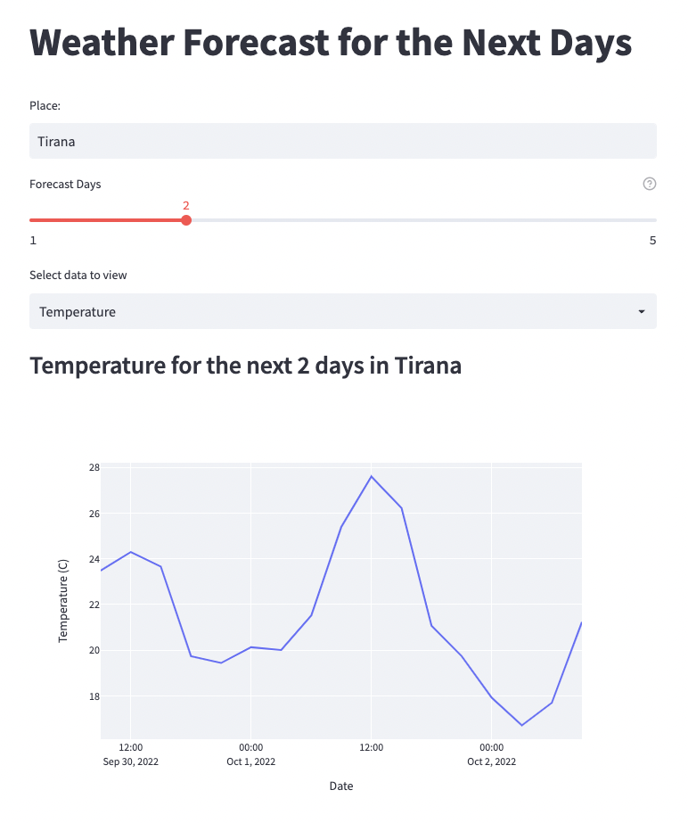
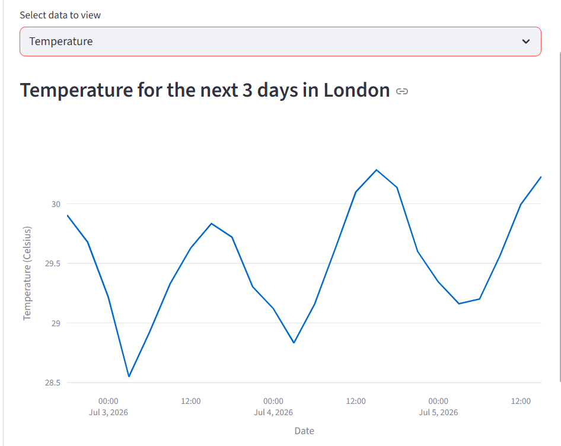
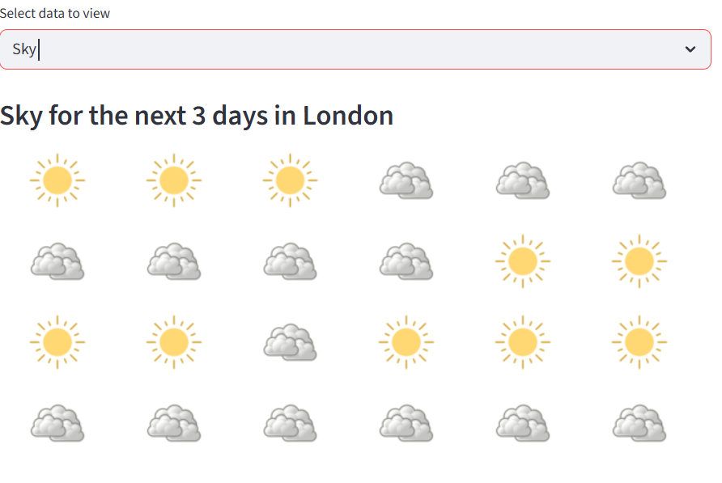

# 🌦️ Weather Forecast Web App

A responsive weather forecasting web application built with **Python**, **Streamlit**, **Plotly**, and the **OpenWeatherMap API**. The application allows users to search for any city and view the weather forecast for up to **5 days**, including temperature trends and sky conditions.

---

## 🚀 Features

- 🌍 Search weather by city name
- 📅 Forecast for the next 1–5 days
- 🌡️ Interactive temperature graph
- ☁️ Display sky conditions with weather icons
- 📊 Beautiful charts using Plotly
- ⚡ Fast and user-friendly interface
- 🌐 Real-time weather data from OpenWeatherMap API

---

## 🛠️ Technologies Used

- Python
- Streamlit
- Plotly Express
- Requests
- OpenWeatherMap API

---

## 📂 Project Structure

```
weather-forecast-app/
│── main.py
│── backend.py
│── Images/
│   ├── clear.png
│   ├── cloud.png
│   ├── rain.png
│   └── snow.png
│── requirements.txt
└── README.md
```

---

## 📦 Installation

### 1. Clone the repository

```bash
git clone https://github.com/RajshreeGholase/weather-forecast-app.git
```

### 2. Navigate to the project folder

```bash
cd weather-forecast-app
```

### 3. Install dependencies

```bash
pip install -r requirements.txt
```

---

## ▶️ Run the Application

```bash
streamlit run main.py
```

The application will open automatically in your default web browser.

---

## 🔑 API Key Setup

This project uses the **OpenWeatherMap API**.

1. Create a free account at:
   https://openweathermap.org/

2. Generate your API key.

3. Open `backend.py` and replace:

```python
API_KEY = "YOUR_API_KEY"
```

with your own API key.

---

## 📋 Requirements

- Python 3.10+
- Streamlit
- Plotly
- Requests

Install manually:

```bash
pip install streamlit plotly requests
```

---

## 📊 How It Works

1. Enter the name of a city.
2. Select the number of forecast days (1–5).
3. Choose either:
   - 🌡️ Temperature
   - ☁️ Sky Conditions
4. The application fetches real-time weather data from the OpenWeatherMap API.
5. Results are displayed as:
   - Interactive temperature chart
   - Weather condition icons

---

## 📷 Screenshots

### Home Page

```markdown

```

### Temperature Forecast

```markdown

```

### Sky Conditions

```markdown

```

---

## 📈 Future Improvements

- 🌍 Auto-detect current location
- 📍 Search suggestions
- 🌅 Sunrise and sunset timings
- 💨 Wind speed and humidity
- 🌧️ Rain probability
- 🌙 Dark mode
- 📱 Mobile-responsive design
- 🌐 Multiple language support
- ⭐ Save favorite cities

---

## 🤝 Contributing

Contributions are welcome!

1. Fork the repository.
2. Create a new branch.
3. Commit your changes.
4. Open a Pull Request.

---

## 📄 License

This project is licensed under the MIT License.

---

## 👩‍💻 Author

**Rajshree Nandkumar Gholase**

- 🎓 B.Tech in Artificial Intelligence & Data Science
- 💻 Python Developer
- 🤖 AI & Machine Learning Enthusiast

---

## ⭐ Support

If you found this project useful, please consider giving it a **⭐ Star** on GitHub!

Your support helps improve the project and motivates future development.